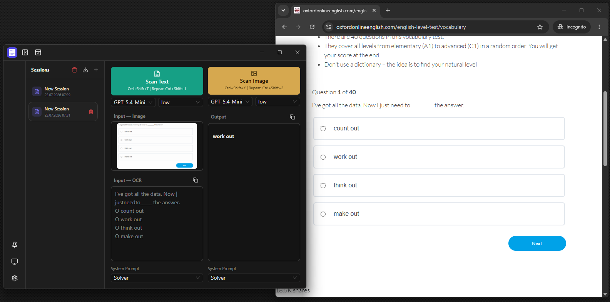
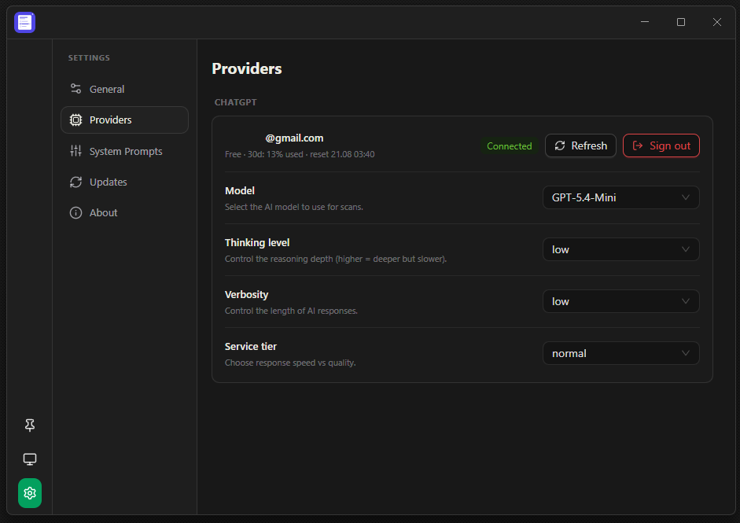

# AIHelper

AIHelper is an Electron desktop application that provides AI-powered text and image analysis using ChatGPT.




---

## Install

1. Download the latest release for your platform from [Releases](https://github.com/bariskisir/aihelper/releases/latest).
2. Install or extract the package.
3. Run **AIHelper**.

## Development

```bash
git clone https://github.com/bariskisir/aihelper.git
cd aihelper
npm run dev
```

## License

MIT
