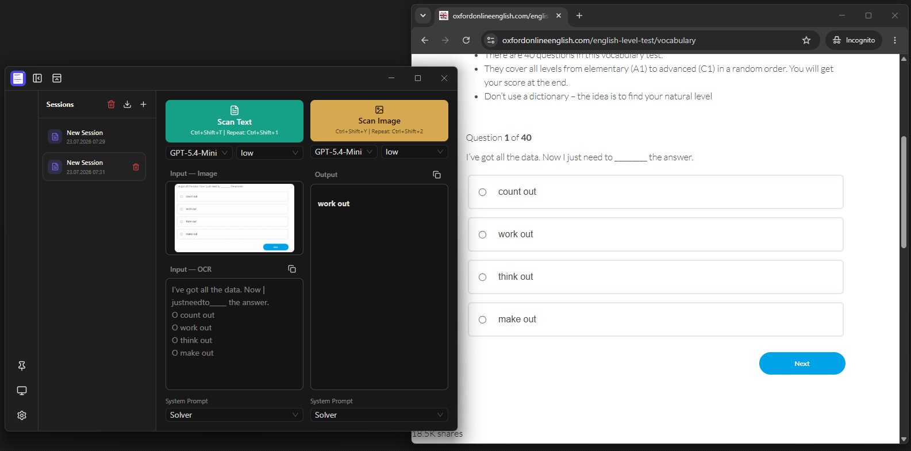
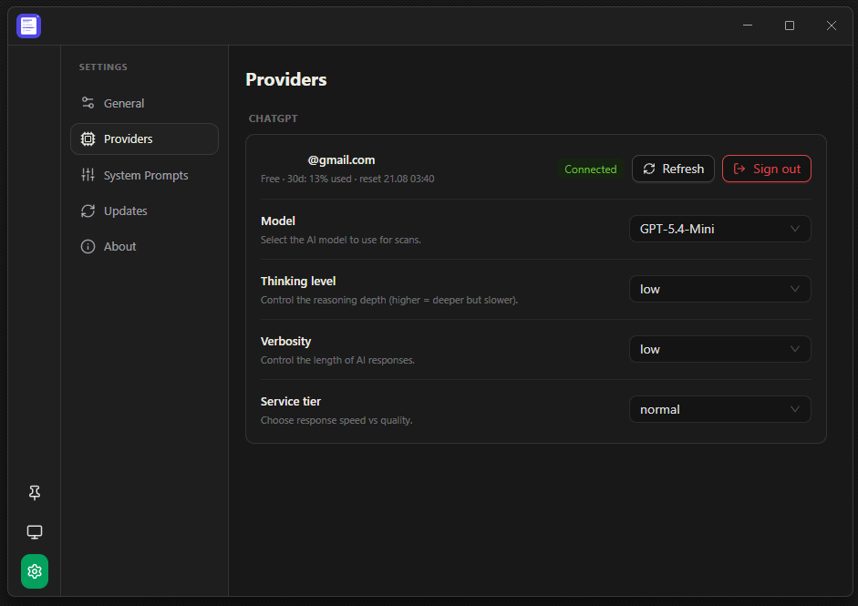

<p align="center">
  
</p>

<h1 align="center">AIHelper</h1>

<p align="center">
  AI-powered text and image analysis with ChatGPT.
</p>

<p align="center">
  <a href="https://github.com/bariskisir/AIHelper/actions/workflows/release.yml"></a>
  <a href="https://github.com/bariskisir/AIHelper/releases/latest"></a>
  <a href="https://github.com/bariskisir/AIHelper/releases"></a>
  <a href="LICENSE"></a>
</p>

<p align="center">
  
  
  
</p>

<p align="center">
  
  
</p>

---

## Install

1. Download the latest release for your platform from [Releases](https://github.com/bariskisir/aihelper/releases/latest).
2. Install or extract the package.
3. Run **AIHelper**.

## Development

```bash
git clone https://github.com/bariskisir/aihelper.git
cd aihelper
npm run dev
```

## License

MIT
